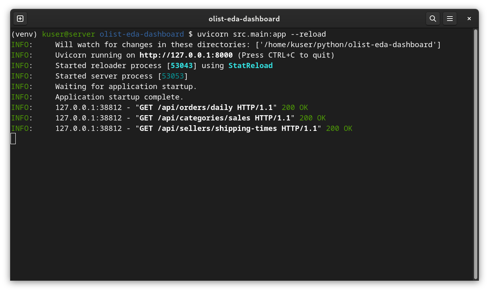
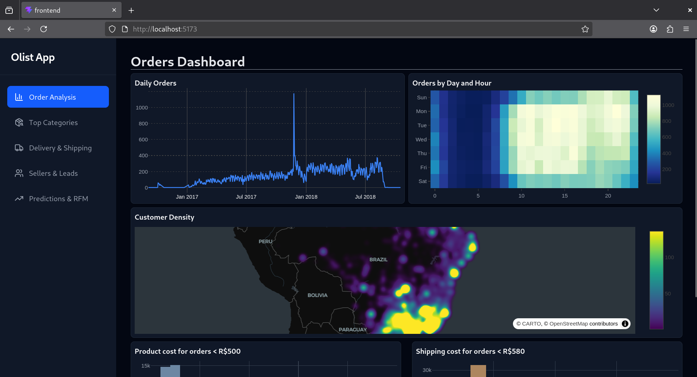

# EDA and Dashboard of an e-commerce dataset
This is a Python implementation of Exploratory Data Analysis (EDA) of the O-List e-commerce dataset.

This will be then visualized through a dashboard onto a web browser by utilizing `flask` and `dash`.

Currently working on the `README.md`.

# TODO
* Create seperate dependencies list (`requirements.txt`) for the API server.
* Note to self, project directory is in: `~/python/`.
* __Show some pictures!__
* Finish API implementations of src/database.py.
* As always, update `README.md`.

# Dependencies
* Python 3 (version 3.1+) - Programming Language
* jupyter-notebook - Notebook application
* pandas - Data manipulation
* numpy - Number calcs
* sqlite3 - Execytubg SQL queries with the relational database (olist.sqlite)
* matplotlib - data charts, graphs, etc.
* plotly - data charts, graphs, etc.
* folium - Rendering geospatial map for CLV and logistics.
* dash - building and deploying web dashboard
* stastsmodels - LOWESS trendline for line graphs
* [FastAPI](https://github.com/fastapi/fastapi) - API engine
* [Uvicorn](https://uvicorn.dev/) (OPTIONAL) - Easy web server to handle the API endpoints

## Frontend
The frontend uses the `React` framework with `Vite` tooling.
* npm - Package mangement
* React - Common TypeScript framework for frontend development.
* Vite - Dev Tooling (dev server, hot module replacement)
* tailwindCSS - CSS web-styling framework
* plotly.js-dist-min - Plotly is a data visualization library (makes graphs). `dist-min` is used pragmatically for scaling purposes.
* lucide - Text icons

# Installtion
Obtain the the O-list dataset through Kaggle:
[https://www.kaggle.com/datasets/terencicp/e-commerce-dataset-by-olist-as-an-sqlite-database](https://www.kaggle.com/datasets/terencicp/e-commerce-dataset-by-olist-as-an-sqlite-database)

Once downloaded, unzip `archive.zip`. Move the unzipped `olist.sqlite` into the same folder (or directory) as the 

Install a notebook viewer. I recommend Jupyter-Notebook, otherwise Google Colab offers an online notebook viewer for free.

Once your notebook viewer is setup, open the `olist-eda.ipynb` file into your viewer.

## Linux
```bash
# Clone repository
$ cd ~/Downloads # (or any folder of your choice)
$ git clone https://github.com/kenmbo/olist-eda-dashboard.git
$ cd olist-eda-dashboard

# Set up python virtual environment (recommended)
$ python3 -m venv .venv
$ source .venv/bin/activate

# Setup notebook viewer (OPTIONAL, only do this if you had not yet installed a notebook viewer yet)
$ pip install notebook

# Open work
$ notebook olist-eda.ipynb

# Get the olist.sqlite file after unzipping the from Archive.zip
# https://www.kaggle.com/datasets/terencicp/e-commerce-dataset-by-olist-as-an-sqlite-database/data
# (Please see Installtion for details)

# Install required packages
pip install pandas numpy matplotlib plotly folium dash
```


### Why do I need to make a virtual environemt?
Basically, for python, it's a good practice.
Venvs can isolate projects from another.
See the following blog article from SAS:
[https://blogs.sas.com/content/sgf/2025/03/14/how-to-create-and-manage-python-virtual-environments/](https://blogs.sas.com/content/sgf/2025/03/14/how-to-create-and-manage-python-virtual-environments/)

## Running the API server
```bash
cd olist-eda-dashboard # (See Linux instructions, only after git clone)
# Create virtual environement (venv)
python3 -m venv .venv
source .venv/bin/activate

# Install dependencies 
# (Pandas for data processing, FastAPI for API state management, Uvicorn for fast web server setup.
pip install pandas statsmodels fastapi uvicorn

# Run API server
uvicorn src.main:app --reload

```



## Running the frontend server
See the sibling repository: [https://github.com/kenmbo/olist-eda-dashboard-frontend](https://github.com/kenmbo/olist-eda-dashboard-frontend)

### Setup

```bash
cd olist-eda-dashboard/
cd frontend/

# Install depndencies
npm install react plotly.js-dist-min lucide-react @tailwindcss/vite@next

# Run server
npm run dev

# Open localhost URL in the web browser of your choice (e.g. Firefox, Chrome, etc.)
# Default url: http://localhost:5173/
```


